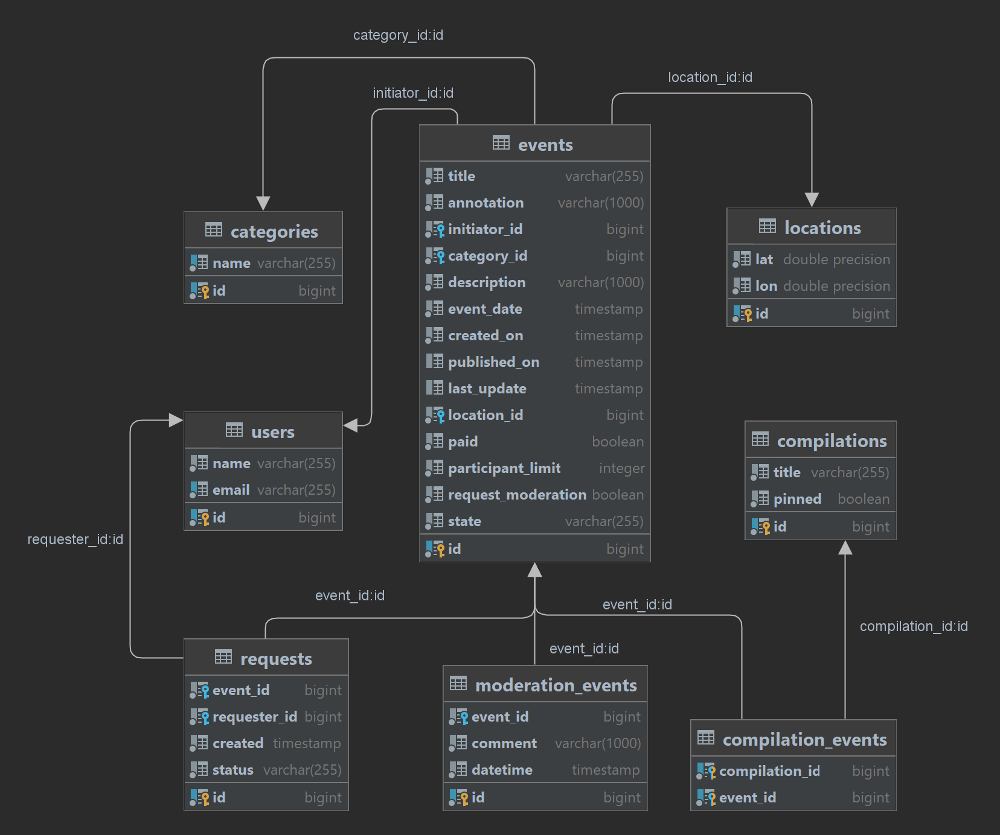

# Explore with me  
## Описание проекта
Приложение - афиша подборок ивентов, создания, поиска, регистрации, модерации заявок пользователей на события.

В основе идея об организации досуга. С помощью приложения пользователи создают свои ивенты, приглашают на них других пользователей, назначают место проведения, время, стоимость входа, вместимость.

## Решения
- Реализован функционал по добавлению пользователей, удалению, получению информации о пользователе по id
- Добавлена работа с категориями событий. Добавление, изменение, удаление (для администраторов)
- Разработан функционал для работы с событиями (ивентами). Добавление события пользователем, получение списка событий, созданных пользователем. Изменение информации о событии, получение информации о запросах на участие в событии, изменение статуса заяки на участие в событии (подтверждена / отклонена)
- Реализована возможность создания подбоок событий, редактировании, удалению (для администраторов)
- Внедрен поиск по событиям и подборкам событий
- Доработам механизм модерации заявок на события с выделением в отдельный функционал
- Разработан отдельный сервис для сбора статистики приложения
- Основное приложение, сервис статистики и БД запускаются раздельно из docker-контейнеров

## Схема БД

## Стек
Java 11, Spring Framework, Spring Boot, Hibernate, PostgreSQL, REST, JPA, Maven, Lombok, Docker 